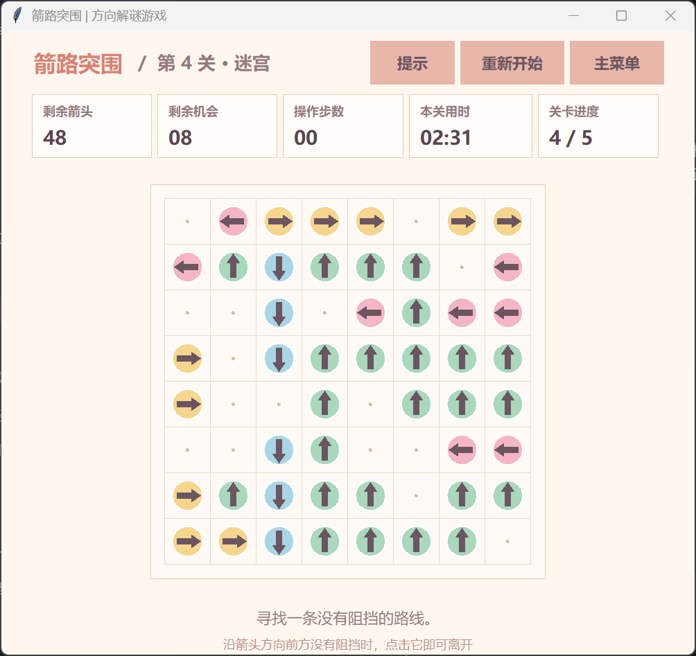

# Arrow Escape（箭路突围）

## 项目名称

Arrow Escape（箭路突围）

## 项目简介

本项目是软件工程课程第二次个人作业，使用 Python 的 Tkinter 图形库实现一个暖色马卡龙风格的中文方向解谜小游戏。玩家点击棋盘中的方向箭头，程序会判断该箭头前进方向上是否存在其他箭头。如果前方无阻挡，箭头会以平滑动画飞出棋盘并消失；如果前方存在阻挡，箭头不会消失，并扣除一次失误机会。当前版本包含 5 个逐步增加规模和思考难度的关卡，以及固定尺寸窗口、矢量箭头、关卡计时器、统计栏、悬停反馈和阻挡反馈。

项目玩法参考老师提供的“一箭又一箭”小游戏页面：

https://sj.qq.com/appdetail/wx69949b45b793b612

本项目只参考基本玩法和交互思路，代码、关卡数据和界面均为独立实现，没有直接使用原游戏的代码、美术素材或关卡。

## 开发环境

- Python 3.10 或以上版本
- Tkinter 图形库
- Pillow 图像库（用于正确合成 GIF 动画帧）
- Windows / Linux / macOS 均可运行

Tkinter 通常随 Python 一起安装，无需额外安装第三方库。

如果在 Ubuntu 中提示没有 `tkinter`，执行：

```bash
sudo apt update
sudo apt install python3-tk
```

运行源码前安装 Pillow：

```bash
python -m pip install Pillow
```

## 运行方法

在项目目录下直接运行源码：

```bash
python main.py
```

在 Windows 中也可以直接双击打包好的 `dist/ArrowEscape.exe` 游玩。

项目中已经提供打包好的 Windows 可执行文件：`dist/ArrowEscape.exe`。

## 打包为 exe

使用 PyInstaller 打包，`--add-data` 会把结算动图资源一起打进可执行文件：

```bash
python -m PyInstaller --noconfirm --clean --onefile --windowed --name ArrowEscape --add-data "assets;assets" main.py
```

生成结果位于 `dist/ArrowEscape.exe`，双击即可游玩。

如果系统中同时存在多个 Python 版本，也可以尝试：

```bash
python3 main.py
```

## 游戏规则

1. 点击棋盘上的任意箭头。
2. 程序会沿着箭头方向检查同一行或同一列。
3. 如果前方没有其他箭头，箭头会飞出棋盘并消失。
4. 如果前方存在其他箭头，箭头会被阻挡，本关剩余失误次数减 1。
5. 清空当前关卡全部箭头后进入下一关。
6. 本游戏共 5 个关卡，棋盘从 5×5 逐步增加到 9×9。
7. 每个关卡都有独立计时器，通关界面会显示本关用时。
8. 失误次数耗尽后游戏失败，可以重新开始。

## 已实现功能

- 开始界面、游戏界面、关卡通过界面、失败界面
- 鼠标点击选择箭头
- 上、下、左、右四种方向箭头
- 基于行列扫描的路径检测
- 箭头飞出动画
- 碰撞高亮反馈
- 剩余箭头数量和剩余失误次数显示
- 5 个规模和难度逐步上升、可正常通关的关卡
- 全中文主界面、游戏界面和提示反馈
- 每关独立计时器
- 第二关起使用固定随机种子生成打散的箭头布局，逐步增加箭头密度与交叉阻挡链
- 每关通关后根据关卡难度、用时和阻挡失误计算 S/A/B/C/D 评分
- 箭头受阻时显示阻挡路径、双方高亮、碰撞震动和脉冲反馈
- 固定 1000×900 游戏窗口，保持界面比例稳定
- 支持窗口标题栏最大化按钮或 `F11` 进入全屏，固定比例画面居中显示
- 当前关卡重新开始功能
- 提示功能
- 菜单返回功能
- 步数和阻挡次数统计
- 成功与失败结算界面展示对应结果图（`assets/result_win`、`assets/result_fail`，支持 GIF 动图逐帧播放）
- `R` 重开当前关卡、`H` 获取提示、`F11` 切换全屏、`Esc` 退出全屏或返回菜单

## 项目文件

```text
arrow_escape_game/
├── main.py
├── assets/
│   ├── result_win.gif
│   └── result_fail.gif
├── dist/
│   └── ArrowEscape.exe
├── test_game_logic.py
├── test_ui_stability.py
├── README.md
└── .gitignore
```

PyInstaller 生成的 `build/` 临时目录、Python 的 `__pycache__/` 缓存目录和 `.spec` 文件属于打包中间文件，不影响游戏运行，可随时删除。

## 逻辑测试

项目包含基础单元测试，用于检查边界箭头、阻挡判断、失效箭头和关卡可解性：

```bash
python -m unittest -v
```

在 Ubuntu 中也可以使用：

```bash
python3 -m unittest -v
```

## 截图说明

下面是游戏进行界面截图：



还可以展示以下过程截图：

- 开始界面
- 游戏进行界面
- 箭头被阻挡时的反馈界面
- 某一关通关界面
- 最终胜利或失败界面

也可以录制一段 GIF 或视频，展示点击箭头、碰撞反馈、通关进入下一关的过程。

## 项目仓库

https://github.com/wizneko/arrow_by_arrow
